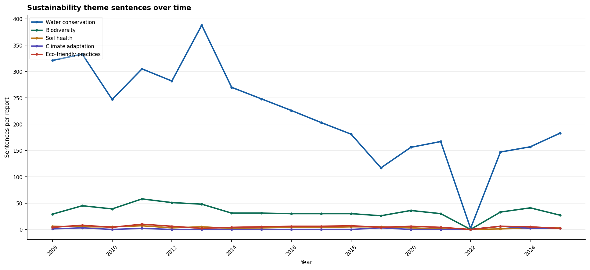
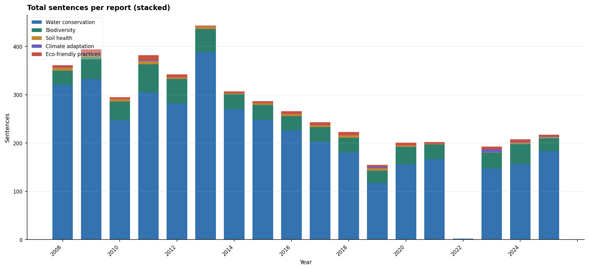
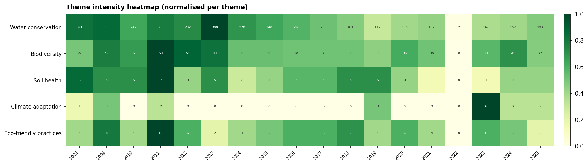

# 🌱 MOEFCC NLP Analysis Project

## 📌 Overview
This project applies **Natural Language Processing (NLP)** techniques to sustainability reports published by the Ministry of Environment, Forest and Climate Change (MOEFCC), India.

The objective is to extract key environmental themes, analyze how they evolve over time, and visualize insights using data analytics techniques.

---

## 🎯 Objectives
- Extract meaningful themes from annual sustainability reports  
- Analyze how environmental focus has evolved over the years  
- Identify key policy trends and topic distributions  
- Generate visual insights using charts and dashboards  

---

## 📂 Project Structure
charts/                     # Generated visualizations  
reports_pdf/                # Source PDFs (excluded from GitHub)  
moefcc_nlp_pipeline.py     # Main NLP pipeline  
themes_over_years.py       # Trend analysis script  
moefcc_demo.html           # Interactive dashboard  
moefcc_sustainability_dataset.csv  # Processed dataset  
requirements.txt           # Dependencies  
README.md  

---

## ⚙️ Technologies Used
- Python  
- Natural Language Processing (NLP)  
- Pandas  
- Matplotlib / Seaborn  
- PDF Text Extraction  

---

## 📊 Features
- 📄 Extracts text from MOEFCC sustainability reports  
- 🧠 Identifies key environmental themes using NLP  
- 📈 Analyzes trends across multiple years  
- 📊 Generates visualizations:
  - Line charts  
  - Stacked charts  
  - Heatmaps  
  - Dashboard view  

---

## 🚀 How to Run

### 1. Install dependencies
pip install -r requirements.txt

### 2. Run NLP pipeline
python moefcc_nlp_pipeline.py

### 3. Generate trend analysis
python themes_over_years.py

### 4. View dashboard
Open the file in your browser:
moefcc_demo.html

---

## 📷 Sample Outputs

### 📈 Trend Analysis

### 📊 Theme Distribution

### 🔥 Heatmap

---

## ⚠️ Note
Due to GitHub file size limitations, large PDF reports are excluded using `.gitignore`.  
All processed data and visual outputs are included for reproducibility.

---

## 📌 Use Cases
- Environmental policy analysis  
- Academic NLP research  
- Sustainability trend tracking  
- Real-world NLP project demonstration  

---

